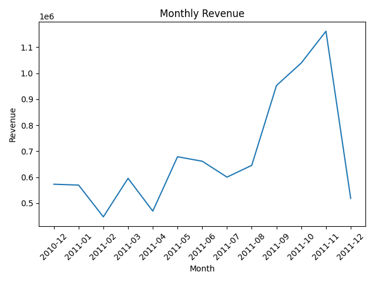
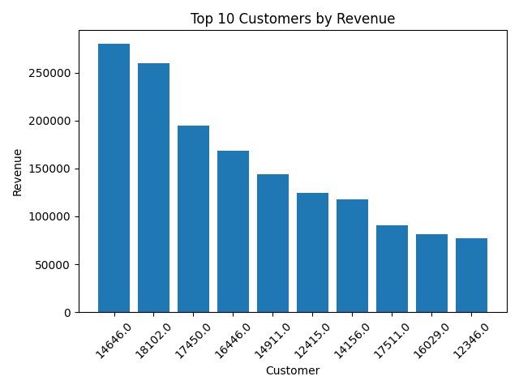
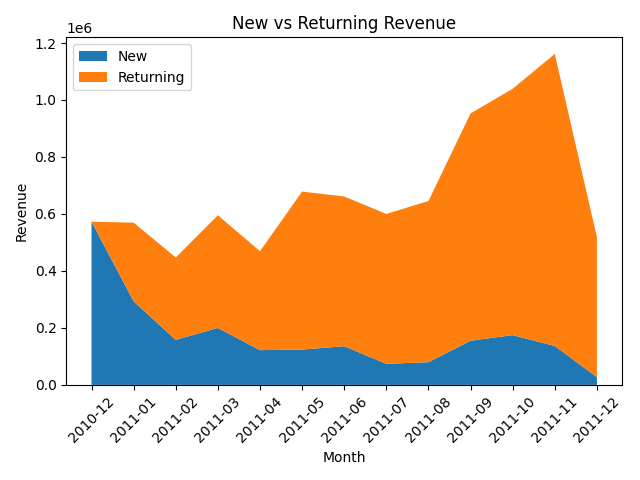

# Retail E-commerce SQL Analytics

## Overview
This project analyzes the **UK online retail dataset (Kaggle)** using **SQL (SQLite)** and **Python (Pandas and Matplotlib)**.

**Goal:** To design a reproducible SQL analytics pipelines that extracts business insights from transaction data.

**Key outcomes:**
- Monthly revenue & order trends
- Top customers and top products by revenue
- New vs. returning customer revenue split (retention analysis)
- Country revenue

## Project Structure
sql-retail-analytics/
- README.md
- data/ # raw input data (zip.csv)
- images/ # analysis results (png plots)
- notebooks/ # Kaggle notebook
- outputs/ # analysis results (csv)

---

## Pipeline
1. **Create clean view (`orders_net`)**
   - Exclude returns(`InvoiceNo` starting with "C"), invalid quantity/price, missing Customer IDs.
2. **Monthly metrics view (`v_monthly_metrics`)**
  - Revenue, orders, unique customers per month.
3. **Top-N Analysis**
  - Top 10 customers & products by revenue.
4. **New vs. Returning revenue (`v_new_vs_return`)**
  - First purchase month vs. subsequent purchases -> retention trend.
5. ** Country-level Revenue**
  - Top revenue contries.
6. **Visualization**
  - Monthly revenue trend (line plot)
  - Top 10 customers (bar plot)
  - New vs. Returning revenue (stacked area plot)

----

### Monthly Revenue Trend

### Top 10 Customers

### New vs Returning Revenue

----

## Insights
- Strong **seasonality** with Q4 spikes.
- **Pareto effect**: Top ~10% customers generate ~60% revenue.
- Returning customers drive consistent revenue, highlighting **retention** as a key business driver.
- Certain countries outperform, suggesing **geo-targeted marketing** potential.

----

## Tech Stack
- **SQL (SQLite via SQLAlchemy)**
- **Python**: Pandas, Matplotplib
- **Kaggle Notebooks* for execution
- Github for reproducibility and sharing

----

## 📎 Links
- 📂 [Kaggle Dataset: Online Retail Data](https://www.kaggle.com/datasets/vijayuv/onlineretail)  
- 💻 [GitHub Repository](https://github.com/Yeonji-Ji/sql-retail-analytics)  
- 🌐 Portfolio: *[https://yeonji-ji.github.io/yeonji-portfolio]*  

